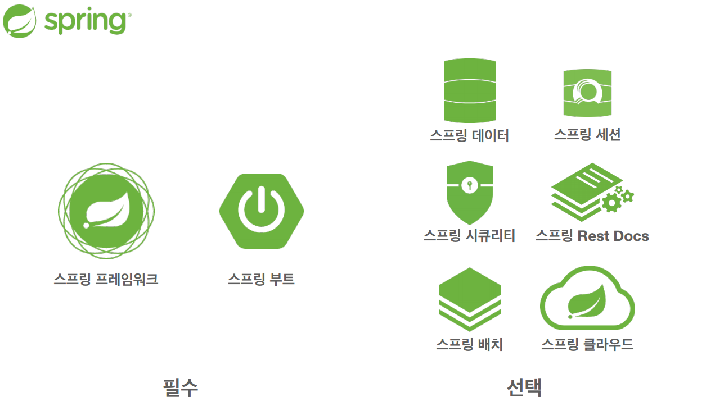
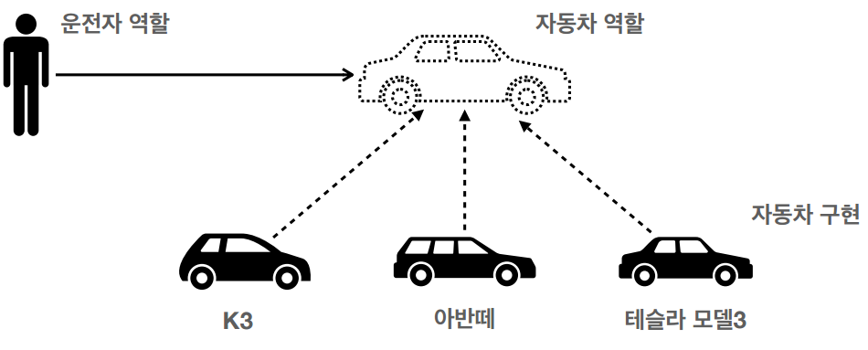

## 스프링 핵심 원리

### 스프링이란?



 - 핵심 기술 : 스프링 DI 컨테이너, AOP, 이벤트, 기타
 - 웹 기술 : 스프링 MVC, 스프링 WebFlux
 - 데이터 접근 기술 : 트랜잭션, JDBC, ORM 지원, XML 지원
 - 기술 통합 : 캐시, 이메일, 원격접근, 스케줄링
 - 테스트 : 스프링 기반 테스트 지원
 - 언어 : 코틀린, 그루비

### 스프링 부트
 - 스프링을 편리하게 사용할 수 있도록 지원, 최근에는 기본으로 사용
 - 단독으로 실행할 수 있는 스프링 애플리케이션을 쉽게 생성
 - Tomcat 같은 웹 서버를 내장해서 별도의 웹 서버를 설치하지 않아도 됨
 - 손쉬운 빌드 구성을 위한 starter 종속성 제공
 - 스프링과 3rd parth 라이브러리 자동 구성
 - 메트릭, 상태 확인, 외부 구성 같은 프로덕션 준비 기능 제공
 - 관례에 의한 간결한 설정

### 핵심
 - 스프링은 자바 언어 기반의 프레임워크
 - 자바 언어의 가장 큰 특징 - **객체 지향 언어**
 - 스프링은 객체 지향 언어가 가진 강력한 특징을 살려내는 프레임워크
 - 스프링은 **좋은 객체 지향** 애플리케이션을 개발할 수 있게 도와주는 프레임워크

---

### 객체 지향 특징
 - 추상화
 - 캡슐화
 - 상속
 - **다형성**

## 다형성

**역할**과 **구현**으로 구분한다.   
장점
 - **클라이언트**는 대상의 역할(인터페이스)만 알면 된다.
 - **클라이언트**는 구현 대상의 **내부 구조를 몰라도** 된다.
 - **클라이언트**는 구현 대상의 **내부 구조가 변경**되어도 영향을 받지 않는다.
 - **클라이언트**는 구현 **대상 자체를 변경**해도 영향을 받지 않는다.

---
#### 자바 언어
 - 자바 언어의 다형성을 활용
   - 역할 = 인터페이스
   - 구현 = 인터페이스를 구현한 클래스, 구현 객체
 - 객체를 설계할 때 역할과 구현을 명확히 분리
 - 객체 설계 시 역할(인터페이스)을 먼저 부여하고, 그 역할을 수행하는 구현 객체 만들기

#### 자바 언어의 다형성

 - 오버라이딩은 자바 기본 문법
 - 오버라이딩 된 메서드가 실행
 - 다형성으로 인터페이스를 구현한 객체를 실행 시점에 유연하게 변경할 수 있다.
 - 물론 클래스 상속 관계도 다형성, 오버라이딩 적용 가능.

```java
public class MemberService {
    private MemberRepository memberRepository = new MemoryMemberRepository();
}
```

```java
public class MemberService {
    // private MemberRepository memberRepository = new MongoMemberRepository();
    private MemberRepository memberRepository = new JdbcMemberRepository();
}
```
### 다형성의 본질
 - 인터페이스를 구현한 객체 인스턴스를 실행 시점에 유연하게 변경할 수 있다.
 - 다형성의 본질을 이해하려면 협력이라는 객체 사이의 관계에서 시작해야 한다.
 - **클라이언트를 변경하지 않고, 서버의 구현 기능을 유연하게 변경할 수 있다.**

## IoC, DI 그리고 Container
### 제어의 역전 IoC(Inversion of Control)
- 기존 프로그램은 클라이언트 구현 객체가 스스로 필요한 서버 구현 객체를 생성하고, 연결하고, 실행하는 방식으로 구현 객체가 프로그램의 제어 흐름을 스스로 조종했다.
- 반면 AppConfig가 등장한 이후에는 객체는 자신의 로직을 실행하는 역할만 담당하고 프로그램의 제어 흐름은 이제 AppConfig가 가져간다.
- 이렇듯 프로그램의 제어 흐름을 직접 제어하는 것이 아니라 외부에서 관리하는 것을 제어의 역전(IoC)라고 한다.

### 프레임워크 vs 라이브러리
- 프레임워크가 내가 작성한 코드를 제어하고, 대신 실행하는 프레임워크이다.(Junit)
- 반면 내가 작성한 코드가 직접 제어의 흐름을 담당하면 그것은 프레임워크가 아니라 라이브러리이다.

### 의존관계 주입 DI(Dependency Injection)
- 의존관계는 **정적인 클래스 의존 관계와, 실행 시점에 결정되는 동적인 객체(인스턴스) 의존 관계** 둘을 분리해서 생각해야 한다.
  - **정적인 클래스 의존관계**
    - 
    - 클래스가 사용하는 import 코드만 보고 의존 관계를 쉽게 판단할 수 있다. 정적인 의존관계는 애플리케이션을 실행하지 않아도 분석할 수 있다.
    - 하지만 이러한 클래스 의존관계 만으로는 실제 어떤 객체가 주입 될지 알 수 없다.

  - **정적인 클래스 의존관계**
    - 
    - 애플리케이션 **실행 시점(런타임)**에 외부에서 실제 구현 객체를 생성하고 클라이언트에 전달해서 클라이언트와 서버의 실제 의존관계가 연결 되는 것을 **의존관계 주입**이라 한다.
    - 객체 인스턴스를 생성하고, 그 참조값을 전달해서 연결된다.

  - **IoC 컨테이너, DI 컨테이너**
  - AppConfig처럼 객체를 생성하고 관리하면서 의존관계를 연결해주는 것을 IoC 컨테이너 또는 DI 컨테이너라고 한다.
  - 의존관계 주입에 초점을 맞추어 최근에는 주로 DI 컨테이너라고 한다.
  - 또는 어샘블러, 오브젝트 팩토리 등으로 불리기도 한다.